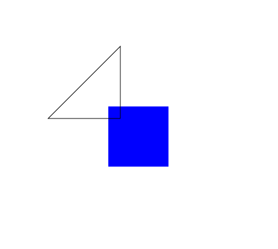

# Something something. Might be a game or an engine idk.

## Compiling
If you do not have Typescript, Node, and NPM, you should install them.

Try something like:
```
cd web
sudo apt install nodejs
sudo apt install npm
sudo npm install -g typescript
```

Then run:
```
tsc index.ts
```
This should result in an index.js file, which the index.html file can use.

## Running
You need an http server to run this. So run:
```
sudo npm install -g http-server
```
Then, run from the main directory:
```
cd web && http-server
```

This will launch a server, which you can view at [http://127.0.0.1:8080](http://127.0.0.1:8080)

One can also, from the main directory, run `./build.sh`, which will cd to the web directory, compile the index.ts file, and then run the server.